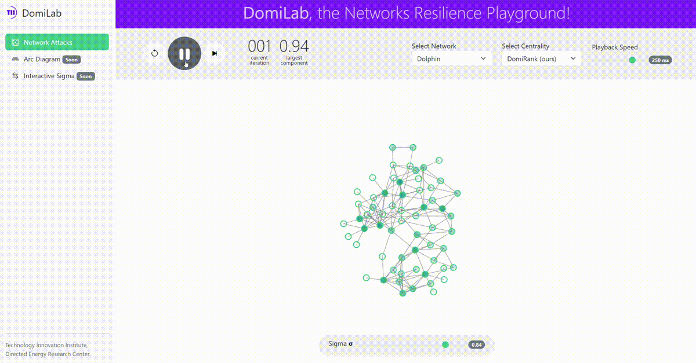

# DomiLab: the Networks Resilience Playground



DomiLab, is a tool that allows you to visualize attacks on complex networks. You can use the tool on [domilab.tii.ae](https://domilab-f7f229c50a39.herokuapp.com/)

### Table of Contents
**[Showcased Centralities](#showcased-centralities)**<br>
**[Showcased Networks](#showcased-networks)**<br>
**[Installation](#installation)**<br>
**[Data Files Structure](#data-files-structure)**<br>

- - - -

## Showcased Centralities
Centrality | Abstract | Paper | Year
| :------ | :---- | :---: | :---:
| DomiRank (ours) | - | [link](https://arxiv.org/abs/2305.09589) | 2023
| PageRank | - | [link](https://github.com/tiiuae/domilab) | -
| Betweenness | - | [link](https://github.com/tiiuae/domilab) | -
| Degree | - | [link](https://github.com/tiiuae/domilab) | -
| Eigenvector | - | [link](https://github.com/tiiuae/domilab) | -


## Showcased Networks
Network | Description | # of Nodes | # of Links
| :------ | :---- | :---: | :---:
[Caenorhabditis elegans (neural)](http://konect.cc/networks/dimacs10-celegansneural/)  | This is a weighted directed network representing the neural network of Caenorhabditis elegans. The original network had directed edges allowing multiple parallel edges with integer weights. In this version, the network is undirected, allows no multiple edges, and the given edge weights are the sum of the original edge weights. As described in the original publication by J. G. White and colleagues, the data was assembled by hand and may contain a small number of errors. To cite: "We are reasonably confident that the structure that we present is substantially correct and gives a reasonable picture of the organization of the nervous system in a typical C. elegans hermaphrodite." | 297 | 4,296
[Dolphins](http://konect.cc/networks/dolphins/)  | This is a directed social network of bottlenose dolphins. The nodes are the bottlenose dolphins (genus Tursiops) of a bottlenose dolphin community living off Doubtful Sound, a fjord in New Zealand (spelled fiord in New Zealand). An edge indicates a frequent association. The dolphins were observed between 1994 and 2001. | 62 | 159
[Erdos-Renyi](https://en.wikipedia.org/wiki/Erd%C5%91s%E2%80%93R%C3%A9nyi_model)  | The Erdős–Rényi model refers to one of two closely related models for generating random graphs or the evolution of a random network. These models are named after Hungarian mathematicians Paul Erdős and Alfréd Rényi, who introduced one of the models in 1959. Edgar Gilbert introduced the other model contemporaneously with and independently of Erdős and Rényi. In the model of Erdős and Rényi, all graphs on a fixed vertex set with a fixed number of edges are equally likely. In the model introduced by Gilbert, also called the Erdős–Rényi–Gilbert model, each edge has a fixed probability of being present or absent, independently of the other edges. | 100 | 190
[Zachary Karate Club](http://konect.cc/networks/ucidata-zachary/)  | This is the well-known and much-used Zachary karate club network. The data was collected from the members of a university karate club by Wayne Zachary in 1977. Each node represents a member of the club, and each edge represents a tie between two members of the club. The network is undirected. An often discussed problem using this dataset is to find the two groups of people into which the karate club split after an argument between two teachers. | 34 | 78
Lattice  | - | 84 | 49

## Installation

## Data Files Structure

## Network JSON Structure
```json
{
  "nodes": [
    {
      "id": 1
    },
    {
      "id": 2
    }
  ],
  "links": [
    {
      "source": 1,
      "target": 2
    }
  ]
}
```
You can find an example from the included networks in [data/lattice/network.json](src/assets/data/lattice/network.json).
  
### *Adding a New Network
  

## Centrality JSON Structure
```json
{
  "values": [
    0.76,
    0.66,
    0.99
    0.05
  ],
  "nodes": [
    3,
    0,
    2,
    1
  ],
  "largest_component": [
    1.0,
    0.9591836734693877,
    0.9387755102040817,
    0.9183673469387755,
    0.8979591836734694
  ]
}
```
You can find an example from the included centralities for the lattice network in [data/lattice/centralities/degree.json](src/assets/data/lattice/centralities/degree.json).
  
### *Adding a New Centrality

  
